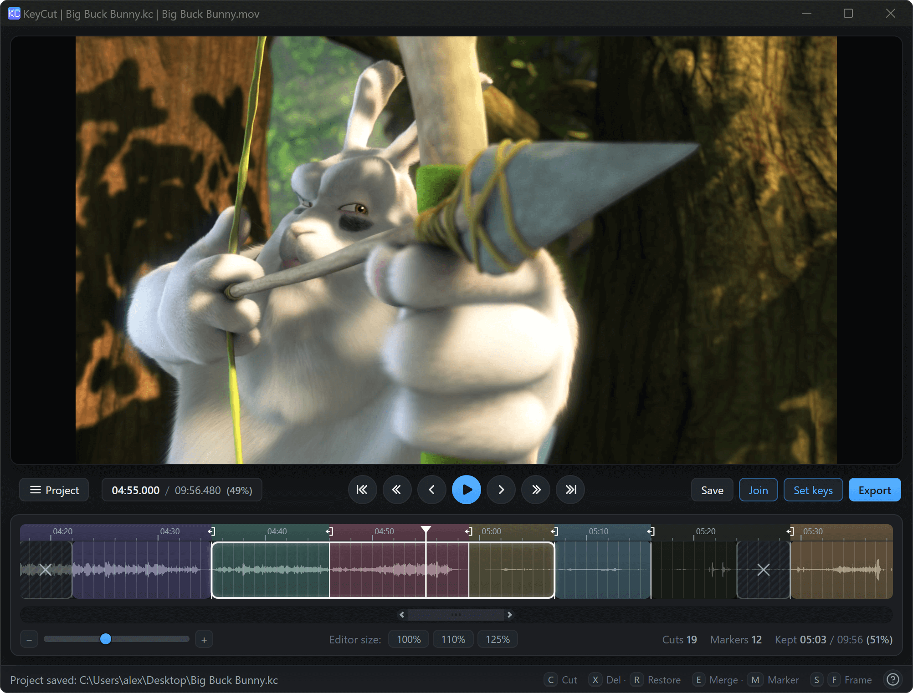

<p align="center">
  <a href="https://webdesign-master.ru"></a>
</p>

<h1 align="center">KeyCut</h1>

<p align="center"><b>Fast lossless video editor</b></p>

<p align="center">
  <a href="https://github.com/wdmcourses/KeyCut/releases"></a>
  <a href="LICENSE"></a>
</p>

<p align="center">KeyCut is a video editor that cuts and joins videos without re-encoding.
It splits video at keyframes and splices the kept parts back together, so the
output keeps the original quality and the whole operation is fast.</p>

<p align="center">
  
</p>

## Features

- Lossless cutting and splicing, no re-encoding, no quality loss
- Split, delete, restore and merge segments directly on the timeline
- Export the kept segments as a single file
- Reads most container formats: MP4, MOV, MKV, WebM, AVI, TS/M2TS, FLV and more
- Portable, no installation required — FFmpeg is bundled

## Keyboard

| Keys | Action |
| --- | --- |
| Space | Play / pause |
| S / F | Previous / next keyframe |
| Shift+S / Shift+F | Previous / next block |
| [ / ] | To start / end of project |
| C | Cut at the caret |
| X / R | Delete / restore segment |
| V | Merge segments |
| Alt + click | Multi-select segments |
| Ctrl+Z / Ctrl+Shift+Z | Undo / Redo |
| Ctrl+O / Ctrl+S | Open / save project |
| Ctrl+E | Export |

## Download

Builds are published on the [Releases](https://github.com/wdmcourses/KeyCut/releases)
page. Download the archive, extract and run `KeyCut`.

### Platform notes

- **Linux:** run this once in the extracted folder, or the app aborts on the Chromium sandbox check:
  ```bash
  sudo chown root:root chrome-sandbox && sudo chmod 4755 chrome-sandbox
  ```
- **macOS:** the build is unsigned, so on first launch right-click `KeyCut.app` → **Open**, or run `xattr -cr KeyCut.app`
- **Windows:** nothing to do — extract and run `KeyCut.exe`

## Recording with OBS

KeyCut cuts only at keyframes, so the more keyframes a file has, the closer a cut can land to the exact frame you want.

In OBS, record with frequent keyframes: add `keyint=6` to the x264/x265 encoder options (or set a low keyframe interval) so a keyframe is written every 6 frames — about every 0.2 s at 30 fps or 0.1 s at 60 fps. This lets you cut with frame-level precision. The trade-off is a slightly larger recording, since every keyframe is an independently decodable frame.

## Building from source

```bash
npm install
npm run ffmpeg   # downloads the static FFmpeg build
npm run pack     # produces the portable build in dist/KeyCut
```

Run the tests:

```bash
npm test            # renderer tests
npm run test:keys   # editing and playback logic
npm run test:scroll # timeline and scrollbar tests
```

## License

[MIT](LICENSE)
